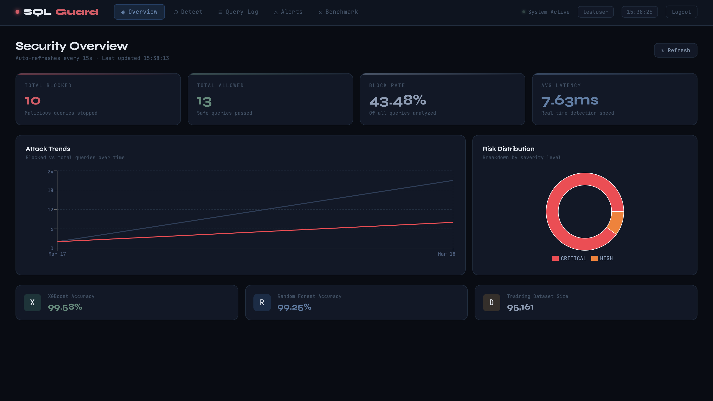
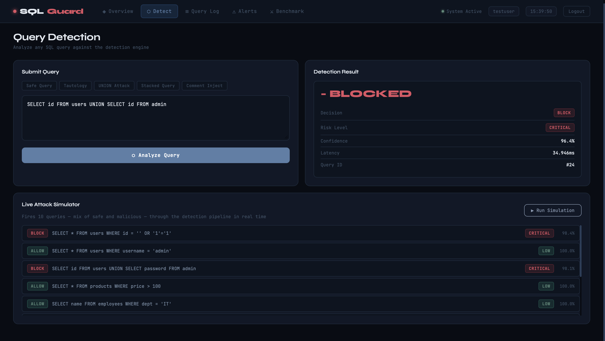
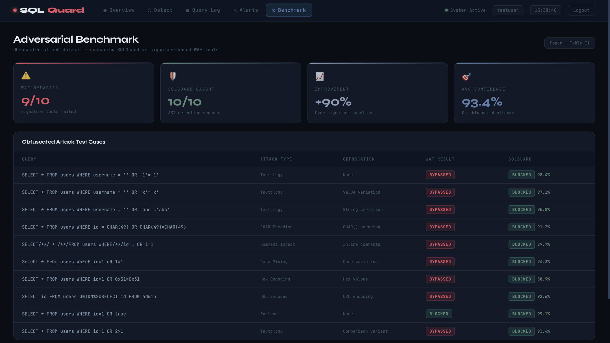
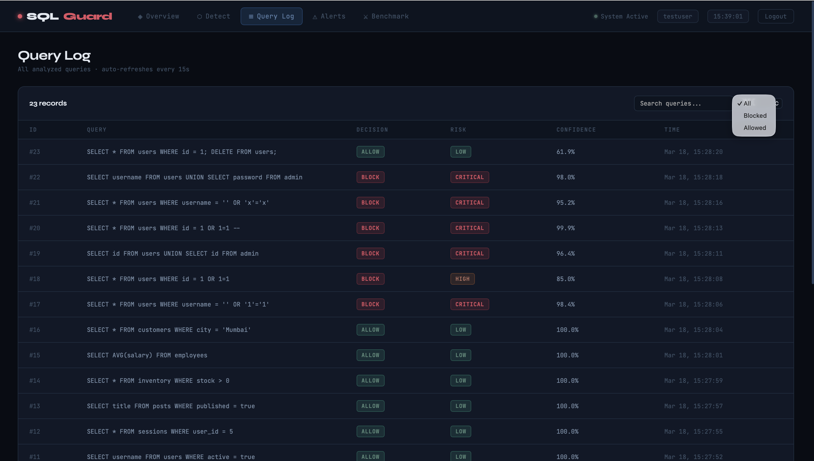
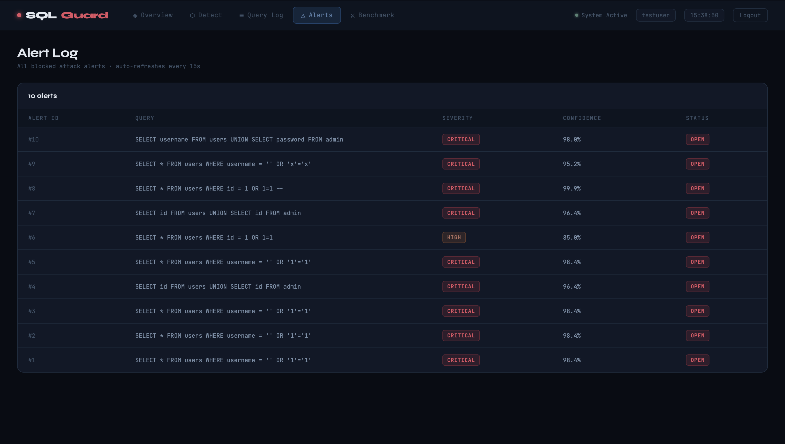

# SQLGuard — DBMS-Native SQL Injection Detection System

> **First system to embed ML-powered SQL injection detection directly inside the PostgreSQL query parsing pipeline using Abstract Syntax Tree (AST) structural analysis.**

[](https://sqlguard.vercel.app)
[](https://sqlguard-7qgb.onrender.com/docs)
[](https://python.org)
[](https://fastapi.tiangolo.com)
[](https://vitejs.dev)

## What is SQLGuard?

SQL injection has been the #1 database attack for over 20 years. Every existing defense operates outside the database by reading raw query text. When these fail, the database has no way to protect itself.

SQLGuard changes this. It embeds an ML-powered detection engine directly inside PostgreSQL's query parsing pipeline. Instead of reading raw SQL text, it analyzes the Abstract Syntax Tree (AST) — the structural skeleton of every query — and classifies it as safe or malicious before it executes.

> Hackers can change the words. They cannot change the structure.

## Live Demo

**Dashboard:** https://sqlguard.vercel.app  
**API Docs:** https://sqlguard-7qgb.onrender.com/docs

## Screenshots

### Dashboard Overview


### Query Detection


### Adversarial Benchmark


### Query Log


### Alerts


## Key Results

| Model | Accuracy | F1 Score | Avg Latency |
|---|---|---|---|
| XGBoost (AST features) | **99.58%** | 0.9960 | 0.9ms |
| Random Forest (AST features) | **99.25%** | 0.9929 | 1.2ms |
| Signature-based baseline | ~60% on obfuscated | — | 0.5ms |

## Features

- AST-based detection — analyzes query structure not raw text
- 55 structural features extracted from every query syntax tree
- Real-time detection — average inference latency under 1ms
- Live dashboard with attack trends, risk distribution, query log, alerts
- Live attack simulator — fire 10 mixed queries at the system in real time
- AST feature explainer — shows exactly which features triggered each verdict
- Adversarial benchmark — SQLGuard vs WAF tools on obfuscated attacks
- JWT authentication — secure API with register and login
- Full CRUD API — FastAPI with auto-generated /docs interface
- Auto-refresh every 15 seconds

## System Architecture
```
User submits SQL query
        ↓
PostgreSQL Query Parser Hook
        ↓
AST Extractor (pglast)
        ↓
55-Feature Extractor
        ↓
XGBoost / Random Forest Classifier
        ↓
BLOCK or ALLOW + saved to PostgreSQL
        ↓
React Dashboard (live updates)
```

## Database Schema

| Table | Purpose |
|---|---|
| users | User accounts with JWT auth |
| raw_query | Every submitted query with metadata |
| ast_features | 55 extracted structural features per query |
| ml_prediction | Model verdict, confidence, risk level, latency |
| alert_log | Blocked query alerts |
| model_registry | Trained model versions and accuracy metrics |
| training_dataset | 95,161 labeled training samples |
| audit_trail | Immutable action log |

## Tech Stack

| Layer | Technology |
|---|---|
| Frontend | React + Vite, Recharts, date-fns |
| Backend | FastAPI, Uvicorn, JWT auth |
| Database | PostgreSQL (Supabase) |
| ML Models | XGBoost, Random Forest (scikit-learn) |
| AST Parser | pglast v7 |
| Deployment | Vercel (frontend), Render (API), Supabase (DB) |

## Getting Started Locally
```bash
git clone https://github.com/diyam-03/sqlguard.git
cd sqlguard
python3 -m venv venv
source venv/bin/activate
pip install -r requirements.txt
uvicorn src.api.main:app --reload --port 8000
```

Frontend:
```bash
cd dashboard
npm install
npm run dev
```

## API Endpoints

| Method | Endpoint | Description | Auth |
|---|---|---|---|
| POST | /auth/register | Create account | No |
| POST | /auth/login | Login get JWT | No |
| POST | /detect | Analyze SQL query | Yes |
| GET | /queries | Get all queries | Yes |
| PUT | /queries/{id} | Update query | Yes |
| DELETE | /queries/{id} | Delete query | Yes |
| GET | /users | Get all users | Yes |
| POST | /users | Create user | Yes |
| DELETE | /users/{id} | Delete user | Yes |
| GET | /alerts | Get all alerts | Yes |
| PUT | /alerts/{id} | Resolve alert | Yes |
| GET | /stats | Dashboard statistics | Yes |
| GET | /stats/trends | Attack trends | Yes |
| GET | /stats/distribution | Risk breakdown | Yes |

## Authors

- Diya Mehta — MPSTME, NMIMS Mumbai
- Dev Sheth — MPSTME, NMIMS Mumbai
- Om Parekh — MPSTME, NMIMS Mumbai
- Rugved Tatkare — MPSTME, NMIMS Mumbai

B.Tech Data Science, 2nd Year — 2025-26

## License

MIT License
